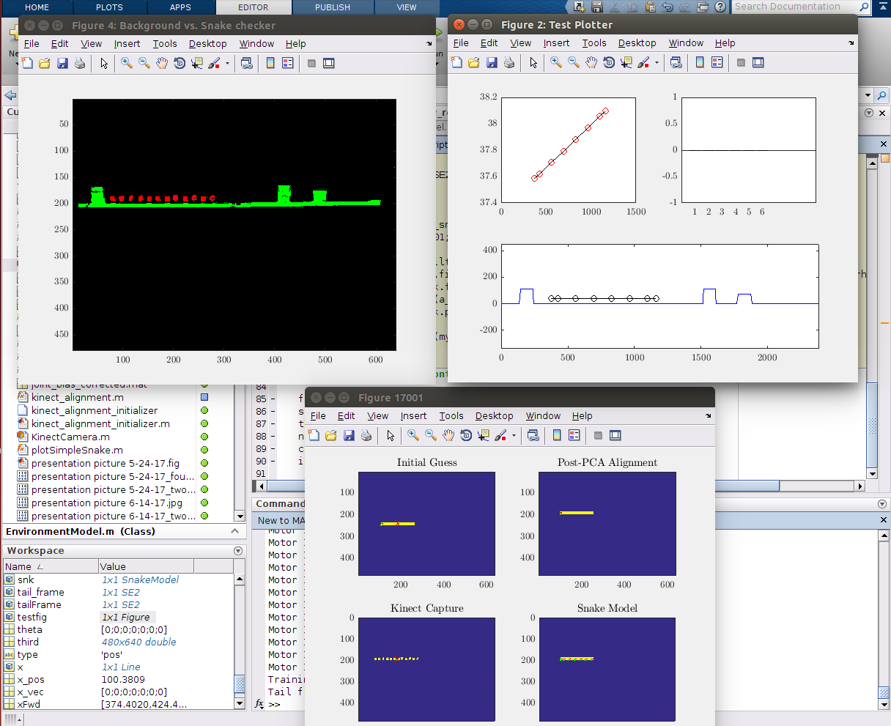
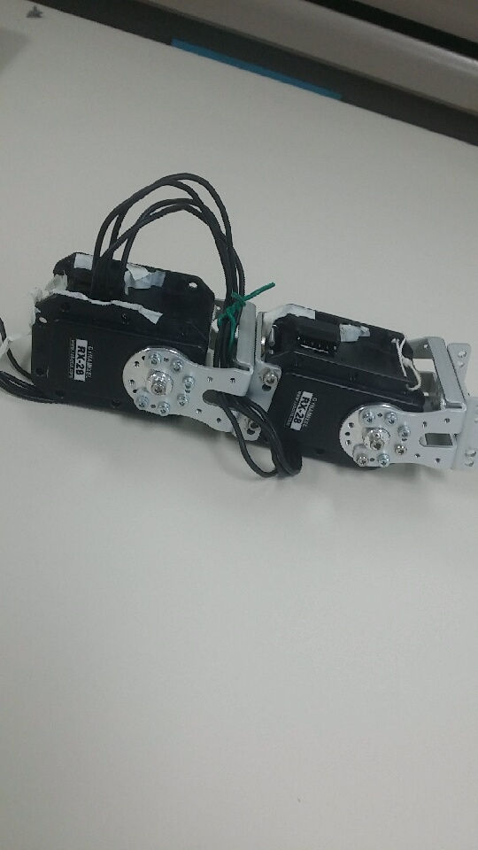
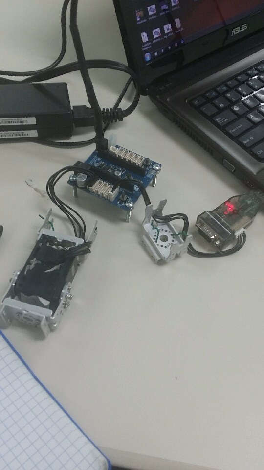

## **Genesis**
# September 11th, 2017
# Welcome to my Research Blog
In the beginning there was nothing....just kidding we had something.

Welcome to my first blog post. Let's get you up to speed regarding my research. After some careful code reorganization and debugging we have completed the visual processing portion of the project. This now gives us more information regarding the environment that the robotic snake is in. We can get exact information that helps us traverse obstacles and engage particular motion primitives.

We will have to rebuild the snake and this time all of the joints will move solely in the x and y plane, however, these small changes will have to be made to the code to adapt to the new dimensions of the snake.

I can illustrate a little bit more here. So the current closed loop process uses object oriented classes that house the information for the snake, the environment, and other things respectively. Therefore when instantiating the Snake model class object we have to pass in the rotational angles, the displacement between each motor joint that moves in the plane we want, and the tailframe in SE2 notation.

So it would look like this.

```markdown

Syntax highlighted code block

%MATLAB program
d = [50,100,150,200,250,300]; %These values would have to change due to the new displacement.  
rot = [0,0,0,0,0,0,0];
tailframe = SE2([0,0],0)
snk = SnakeModel(d,rot,tailframe);

%these are merely arbitrary values to illustrate the example
```



Here is an image of the modeling user interface here.


## **Reconstruction of the Snake**
# September 18, 2017
# I promise you we didn't break the snake!

So originally the snake we were using moved in the x, y, and z directions and thus we would zero out the motors that move in the z direction so it would not be engaged. This would result in the link length including this motor to be twice as long as a link length containing only motors that move in the xy plane. We were also trying to make the deadline for the International Conference on Robotics and Automation which was September 15th, however, we were not making reasonable progress. This however allows us to shoot for the next robotics conference deadline which is the International Conference on Intelligent Robots and Systems (IROS). So we have time to create a new snake for our research project.



The image above is what two motors when connected by the aluminum bracket would look like. Each motor is connected in series with the motor in front of it and behind it using a serial 4 pin connection. Some of the advantages of rebuilding it this way give us a robot that is able to articulate over obstacles in the environment better.


