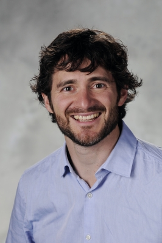

### About my Research Lab

## My professor

# Dr. Patricio Vela

Associate Professor in the Electrical and Computer Engineering Department. A Mexico City native, he graduated from California Institute of Technology after completing his Bachelor's of Science degree in 1998 and getting his doctorate in 2003. His field of research for his doctorate was geometric nonlinear control androbotics.

Upon completing his doctorate, he pursued post-doctoral research in the computer vison field and became a member of the Georgia Tech ECE Faculty in 2005.

Currently a few of his research interests are invested in
- Computer Vision
- Geometric Control
- Robotics

Find out more about him, his publications, patents, awards, and current fields of interests. [here](https://www.ece.gatech.edu/faculty-staff-directory/patricio-antonio-vela)

## My Laboratory

# Intelligent Vision and Automation Laboratory

Housed in the Technology Square Research Building on the 4th floor and hosts undergraduate and graduate projects focused in Robotics and Automation.\n

Bla Bla
